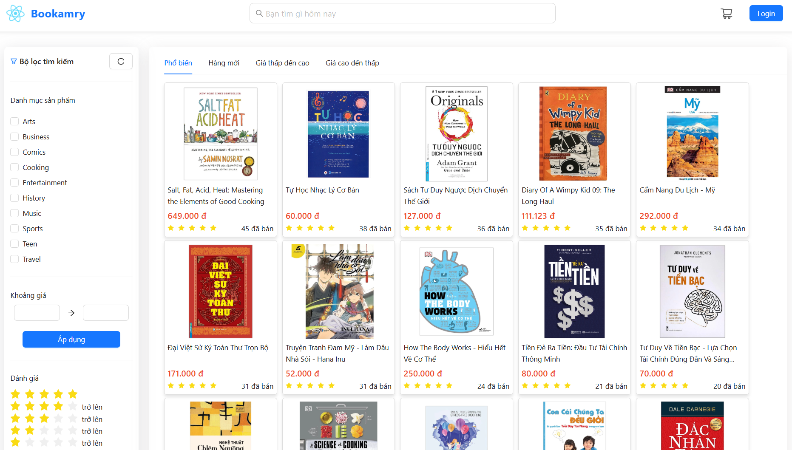
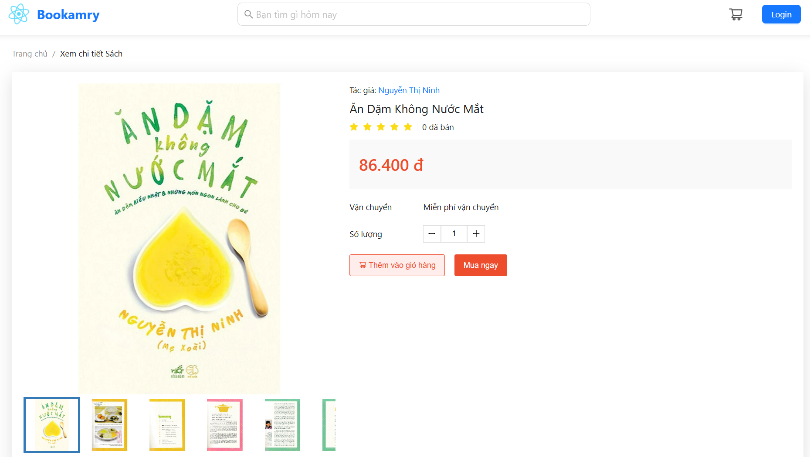
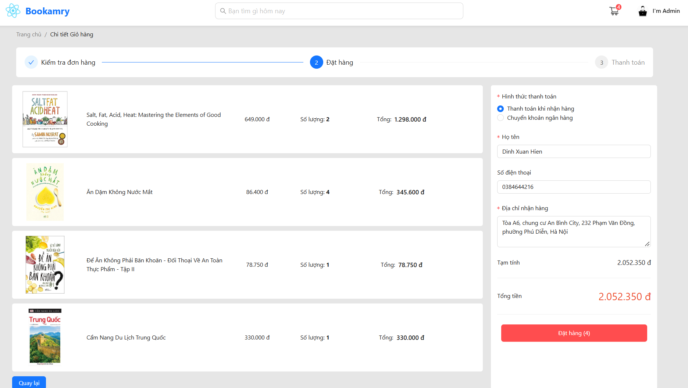
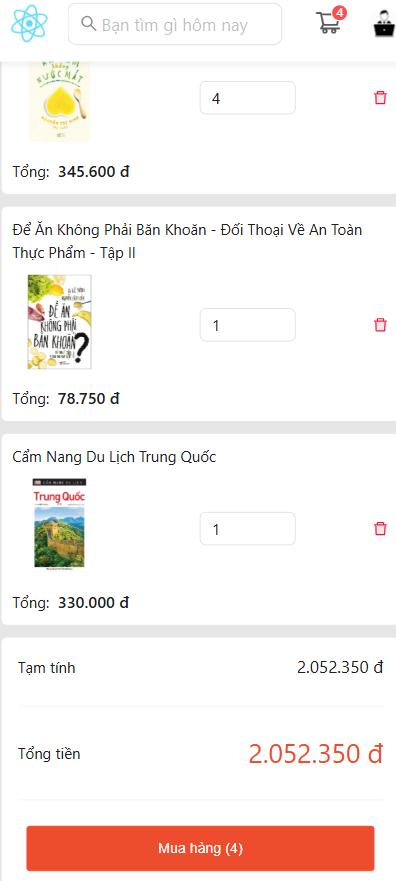
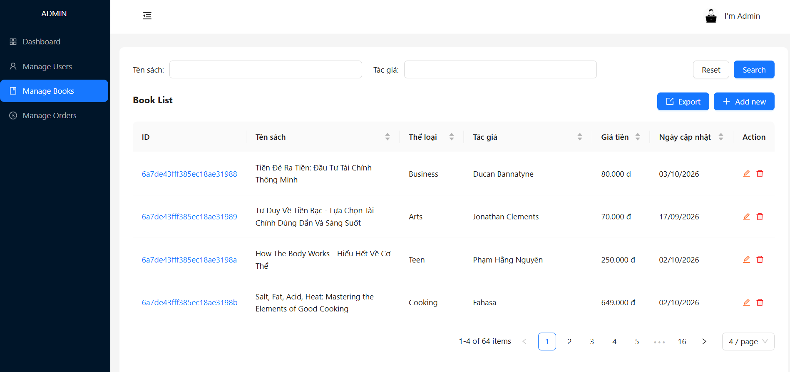
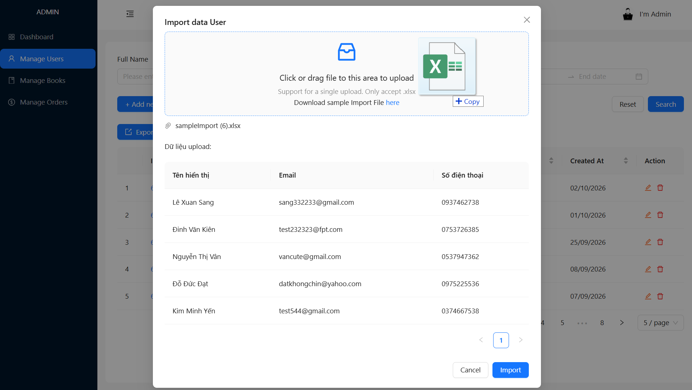
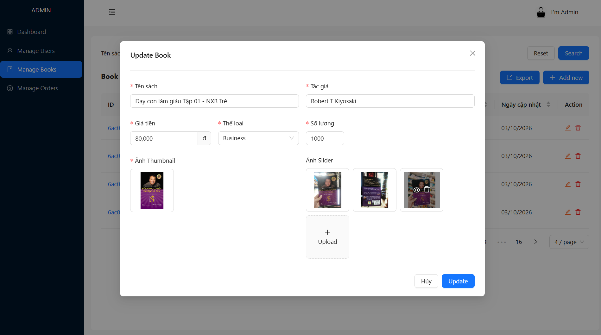

# Bookamry - React web app

- **Overview:** A React web app for books management and sales.
- **Technology:** React.JS, Ant Design.
- **Target Users:** Bookstores and customers want to purchase books online.
- **Key Features:**
  - Management of books, user accounts, and orders.
  - An user-friendly interface showing detailed book information.
  - Supports Excel file processing and image handling, ensure an enhanced experience.
- **Demo:** Open [this website](https://www.bookamry.io.vn) to view demo of this repository.

## User Interface (UI)

### 1. Homepage

  

    
PC

    
  

  

    
Mobile

    
  

---

### 2. Book Details

  

    
PC

    
  

  

    
Mobile

    
  

---

### 3. Cart

  

    
PC

    
  

  

    
Mobile

    
  

---

### 4. Admin - Book Management

  

---

### 5. Admin - Import Users

  

---

### 6. Admin - Update Book

  

---

### 7. Admin - View Image

  

